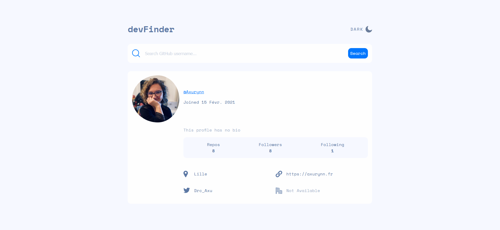
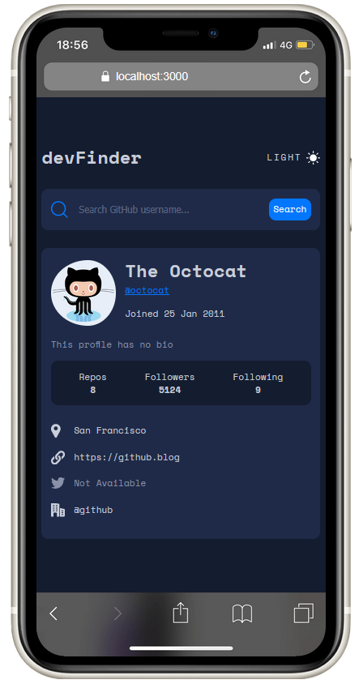

# Frontend Mentor - GitHub user search app solution

This is a solution to the [GitHub user search app challenge on Frontend Mentor](https://www.frontendmentor.io/challenges/github-user-search-app-Q09YOgaH6). Frontend Mentor challenges help you improve your coding skills by building realistic projects. 

## Table of contents

- [Frontend Mentor - GitHub user search app solution](#frontend-mentor---github-user-search-app-solution)
  - [Table of contents](#table-of-contents)
  - [Overview](#overview)
    - [The challenge](#the-challenge)
    - [Screenshots](#screenshots)
    - [Links](#links)
  - [My process](#my-process)
    - [Built with](#built-with)
  - [Author](#author)
  - [Acknowledgments](#acknowledgments)

## Overview

### The challenge

Users should be able to:

- View the optimal layout for the app depending on their device's screen size
- Search for GitHub users by their username
- See relevant user information based on their search
- Switch between light and dark themes

### Screenshots

Desktop screenshot

Mobile screenshot

### Links

- Solution URL : [IP Address Tracker](https://github.com/Axurynn/ip-address-tracker)
- Live solution: [IP Address Tracker - Live](https://axurynn.github.io/ip-address-tracker/)

## My process

### Built with

- Semantic HTML5 markup
- SCSS custom properties
- Flexbox
- Mobile-first workflow
- [ReactJS](https://reactjs.org/) library
- [ViteJS](https://vitejs.dev/)

## Author

- Website - [Axurynn](https://axurynn.fr)
- Frontend Mentor - [@axurynn](https://www.frontendmentor.io/profile/axurynn)
- Twitter - [@Drc_Axu](https://www.twitter.com/Drc_Axu)

## Acknowledgments

Special thanks to [Baptjack](https://baptjack.fr) who help me completed this challenge.